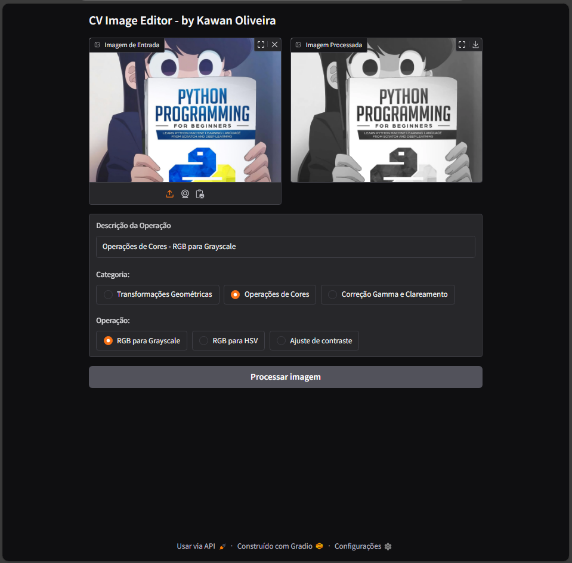

# 🖼️ CV Image Editor - by Kawan Oliveira

## 📌 Visão Geral

O **CV Image Editor** é uma aplicação interativa para edição de imagens com foco em transformações geométricas, manipulações de cor e correção de brilho/gamma. A interface gráfica é construída com [Gradio](https://www.gradio.app/), e o processamento de imagens é realizado com OpenCV e Pillow.

---

## ⚙️ Instalação

Para rodar o projeto localmente, você precisa ter Python 3.7+ instalado. Em seguida, instale as dependências:

```
pip install gradio opencv-python pillow numpy
```

---

## 🚀 Uso

Execute o script principal com:

```
python nome_do_arquivo.py
```

A interface Gradio será iniciada no navegador padrão.

---

## 🎨 Funcionalidades

O projeto é dividido em três categorias principais de operações:

### 1. Transformações Geométricas
- **Translação**: Move a imagem horizontal e/ou verticalmente.
- **Rotação**: Gira a imagem em torno do centro.
- **Escala**: Aumenta ou diminui o tamanho da imagem.

### 2. Operações de Cores
- **RGB para Grayscale**: Converte a imagem para tons de cinza.
- **RGB para HSV**: Converte a imagem para o espaço de cor HSV.
- **Ajuste de Contraste**: Aplica multiplicação de intensidade nos valores dos pixels.

### 3. Correção Gamma e Clareamento
- **Correção de Gamma**: Aplica correção de brilho com base na fórmula:  
  `I_out = I_in^(1/gamma)`

---

## 🔧 Explicação Técnica

### Conversão de Formatos
- **PIL ↔ OpenCV**: Funções `pil_to_cv` e `cv_to_pil` facilitam a interoperabilidade entre os dois formatos de imagem.

### Transformações
- Utilizam `cv2.warpAffine` e `cv2.resize`, com matrizes de transformação apropriadas para cada operação.

### Correção Gamma
- Utiliza uma **LUT (Look-Up Table)** para acelerar o cálculo de valores corrigidos para cada nível de pixel (0–255).

---

## 🧪 Interface Gradio

A interface permite ao usuário:

- Carregar uma imagem.
- Escolher uma **categoria** e depois uma **suboperação**.
- Ajustar os **parâmetros** conforme necessário via sliders.
- Visualizar a **imagem processada** e a descrição da operação.

### Componentes de Entrada:
- `gr.Image`: Upload da imagem.
- `gr.Radio`: Seleção de categoria e operação.
- `gr.Slider`: Parâmetros ajustáveis como contraste, ângulo, escala, deslocamentos e gamma.

### Comportamento Dinâmico:
- A visibilidade e opções dos sliders mudam com base na operação escolhida (`update_suboptions` e `update_controls`).


---

## ▶️ Execução

A execução acontece com:

```python
create_interface()
```

Que monta e lança a interface.

---
